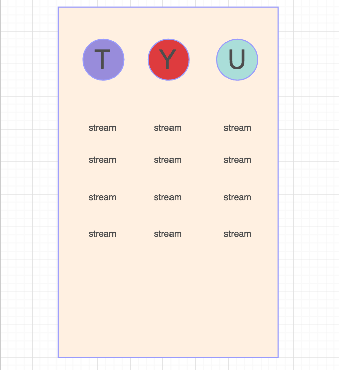

# TopStream
aggregate of all top streamers from every major streaming website

A stream aggregator that targets streams based on popularity accross streaming platforms.

Wireframe

User Story:
The user should be presented with a home screen that displays a large header and to lists of information with stream previews and data.
They then can choose which stream they would like to watch, based on the information they are presented with, such as view count or position in the top ten.
Upon clicking on a streamer name, they will be redirected in a new tab to a new page belonging to the streamer.
A like and dislike button will be available to click to submit a 1 or -1 to that users tables in the database.

The app structure should be fairly simple, 2 pages or less for any user. This app will definitely be heavy on the backend of development, and front end should be kept simple but effective in display.

Expected challenges are in the api; retrieval and updating data continuously from multiple apis.

Tech:
"body-parser": "^1.18.2", used for sorting through the body to find requested data
"dotenv": "^4.0.0", allows a .env file to be used and ignored to store sensitive data
"ejs": "^2.5.7", a js file type that can contain html and js within the server environment
"express": "^4.16.2", npm package that connects files to be served with specific intentions
"isomorphic-fetch": "^2.2.1", enables the use of fetch requests
"method-override": "^2.3.10", allows the use methods inside the post.
"morgan": "^1.9.0", a logger
"pg-promise": "^7.0.3", a package to enable the use of psql queries on our server.

Phases of Completion

The first step is going to be reading all of the api documentations and getting all the apis working properly.
Setup the file system for the backend.
Design a view that is simple but engaging.
Fetch apis on back and retrieve json.
Parse.
Organize and present.
Test.

Code snippet:
function getYouTubeApi(req, res, next) {
  fetch(`https://www.googleapis.com/youtube/v3/search?part=snippet&eventType=live&type=video&regionCode=US&order=viewcount&maxResults=10&key=${process.env.ytkey}`)
  .then(fetchRes => fetchRes.json())
  .then(jsonFetchRes => {
    // console.log(jsonFetchRes)
    res.locals.streams2 = jsonFetchRes;

      for(i=0; i<10; i++){
        let streamIdCatcher = jsonFetchRes.items[i].snippet.channelId
        let streamNameCatcher = jsonFetchRes.items[i].snippet.channelTitle

        console.log(streamIdCatcher, streamNameCatcher)

        db.query(`
          INSERT INTO youtube_ratings_table (
            streamer_id,
            channel_name
          ) VALUES (
            $1,
            $2
          ) ON CONFLICT DO NOTHING
          RETURNING *
          `,[streamIdCatcher, streamNameCatcher])
      }

    data = jsonFetchRes;
    next()
  }).catch(err =>{
    res.json({err})
  })

}

this snippet of code while not very complicated, taught me a lot about how the mvc model can be combined into one file, and I use it as a helper function to assist in sending data to db on load.

Looking forward:
I want to revisit it to work on the styling.

installation requires cloning, and running npm install, to retrieve dependencies.

start app on terminal inside root of project folder using npm run dev.

go to localhost:3000
